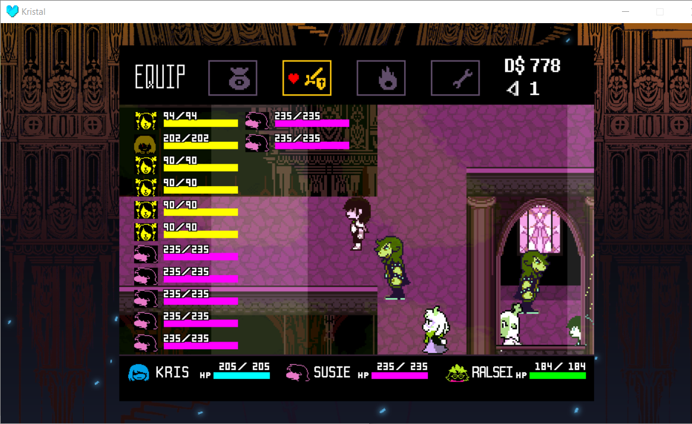
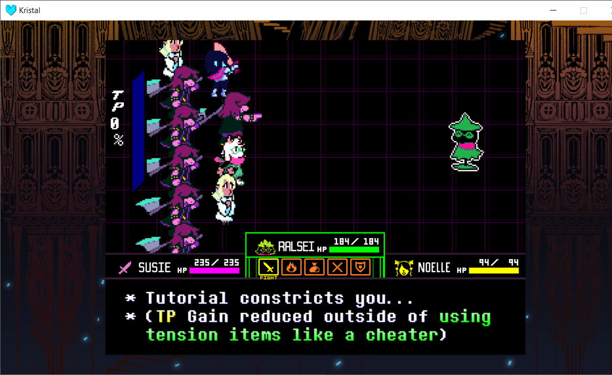
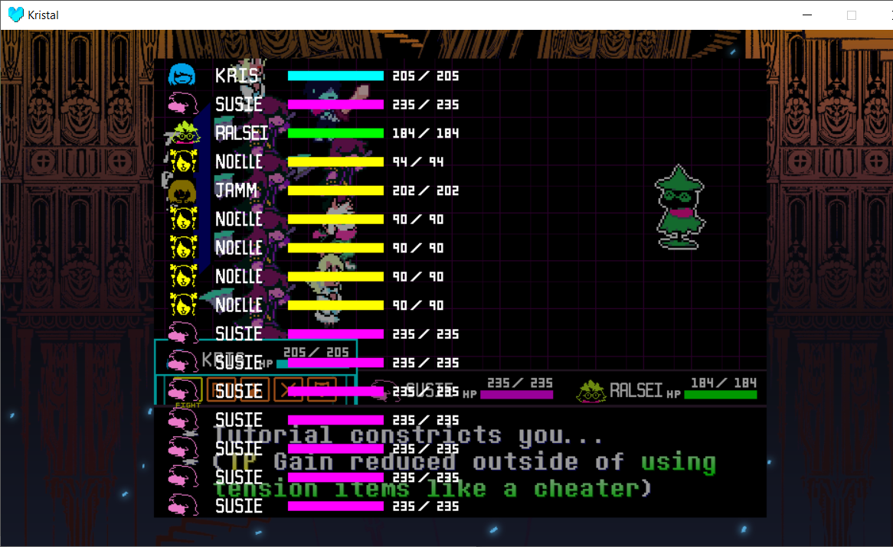
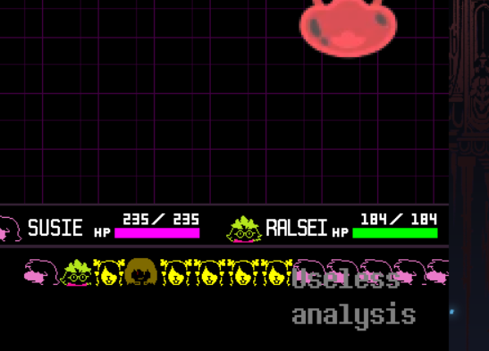

# EvenMoreParty
A library for Kristal. The name is exactly what you'd expect.

## Features;
Party health shown to a side in the menu 

 

Wacky gradienting to show extras in the equip/power menu 

 

Action Boxes are NOT scaled down! they slide to a side to show the next member! (in battle, too!) 

## KEYBINDS;
V - Show Party Health (battle) 

 
 

TODO;
- Multi-act menu not making a whole line of icons (maybe scale? Make an icon that just says "ALL"?) 